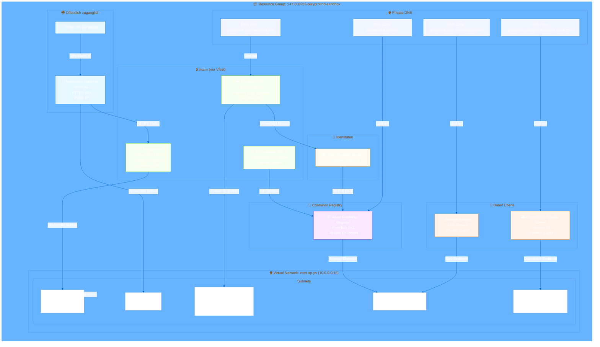

# Azure Infrastruktur - Dokumentation

**Zielgruppe:** Terraform- und Netzwerk-Beginner

Diese Dokumentation erklart die Azure-Infrastruktur, die mit Terraform verwaltet wird. Sie ist so aufgebaut, dass auch Einsteiger ohne tiefes Vorwissen in Azure oder Terraform sie verstehen konnen.

---

## Inhaltsverzeichnis

1. [Ubersicht](#ubersicht)
2. [Netzwerk-Topologie](#netzwerk-topologie)
3. [Komponenten im Detail](#komponenten-im-detail)
4. [Terraform-Struktur](#terraform-struktur)
5. [Deployment-Anleitung](#deployment-anleitung)
6. [Container-Deployment per GitHub Actions](#container-deployment-per-github-actions)
7. [Haufige Fragen (FAQ)](#haufige-fragen-faq)

---

## Ubersicht

Diese Infrastruktur stellt eine sichere, skalierbare Azure-Umgebung fur die Ausfuhrung von Container-Anwendungen bereit. Sie nutzt folgende Hauptkomponenten:

- **Netzwerk:** Virtuelles Netzwerk (VNet) mit mehreren Subnetzen fur Isolation
- **API-Management:** Azure API Management (APIM) fur API-Gateway-Funktionalitat
- **Application Gateway:** Web Application Firewall (WAF) fur Sicherheitsprufungen
- **Container Apps:** Serverlose Container-Ausfuhrungsumgebung
- **Container Registry:** Azure Container Registry (ACR) fur Docker-Images
- **Datenbank:** PostgreSQL Flexible Server
- **Speicher:** Azure Blob Storage fur Dateien

Alle Komponenten kommunizierenuber private IP-Adressen (kein offentlicher Internetzugriff), außer dem Application Gateway, das als einziger offentlicher Einstiegspunkt dient.

---

## Netzwerk-Topologie



---

## Komponenten im Detail

### fur Netzwerk-Beginner: Was ist ein VNet?

Ein **Virtual Network (VNet)** ist wie ein eigenes, privates Internet in Azure. Stelle es dir vor wie ein Burogebaude:

- **Das gesamte Gebaude** = Dein VNet (`10.0.0.0/16`)
- **Die Stockwerke** = Deine Subnetze (z.B. `10.0.1.0/24`, `10.0.3.0/24`)
- **Die Buros** = Deine Server/Dienste in jedem Subnetz

Jedes Subnetz hat eine spezifische Funktion und Isolation:

| Subnetz | IP-Bereich | Zweck | Delegation |
|---------|-----------|-------|------------|
| snet-apim | 10.0.1.0/24 | API Management | Microsoft.ApiManagement/service |
| snet-appgw | 10.0.3.0/24 | Application Gateway | - |
| snet-private-endpoints | 10.0.4.0/23 | Private Endpoints fur ACR, Blob | - |
| snet-container-apps | 10.0.8.0/23 | Container App Environment | Microsoft.App/environments |
| snet-databases | 10.0.6.0/24 | PostgreSQL Datenbank | Microsoft.DBforPostgreSQL/flexibleServers |

**Warum so viele Subnetze?**
- **Sicherheit:** Isolation von Komponenten (wenn eine Komponente kompromittiert wird, sind andere geschutzt)
- **Compliance:** Manche Dienste benotigen dedizierte Subnetze
- **Netzwerk-Routen:** Verschiedene Routing-Regeln pro Subnetz

---

### fur Terraform-Beginner: Was macht was?

#### Resource Group (rg)
```terraform
resource "azurerm_resource_group" "rg" {
  name     = "1-050082d2-playground-sandbox"
  location = "eastus"
}
```
**Was ist das?** Eine Resource Group ist wie ein Ordner in Azure. Alle Ressourcen, die zusammengehoren, kommen in eine Resource Group.

**Warum brauchen wir das?**
- Organisation: Alle Ressourcen dieser Infrastruktur sind in einer Gruppe
- Berechtigungen: Zugriff kann pro Resource Group gesteuert werden
- Lebenszyklus: Loschen der Resource Group loscht alle Ressourcen darin

---

#### Virtual Network (vnet)
```terraform
resource "azurerm_virtual_network" "vnet" {
  name                = "vnet-ap-pv"
  address_space       = ["10.0.0.0/16"]
  location            = azurerm_resource_group.rg.location
  resource_group_name = azurerm_resource_group.rg.name
}
```

**Was ist `address_space`?**
- Das ist der IP-Adressbereich, den dein VNet verwenden darf
- `10.0.0.0/16` bedeutet: Alle IPs von 10.0.0.1 bis 10.0.255.254
- `/16` ist die Netzwerkmaske (gibt an, wie viele IPs verfügbar sind)

---

### Hauptkomponenten

#### 1. Application Gateway (appgw)

**Was ist das?**
Das Application Gateway ist wie ein **Pförtner** fur deine Anwendung:

- **Empfangt Anfragen** von Benutzern aus dem Internet (HTTPS auf Port 443)
- **Prunft die Anfragen** mit der Web Application Firewall (WAF)
- **Leitet Anfragen weiter** an das API Management
- **Terminiert SSL/TLS** (entschlusselt HTTPS)

**Wichtige Einstellungen:**
```terraform
sku {
  name     = "WAF_v2"  # Web Application Firewall Version 2
  tier     = "WAF_v2"
  capacity = 2         # 2 Instanzen fur Ausfallsicherheit
}

waf_configuration {
  enabled          = true
  firewall_mode    = "Prevention"  # Blockiert schadliche Anfragen
  rule_set_type    = "OWASP"       # OWASP Top 10 Regeln
  rule_set_version = "3.2"
}
```

**WAF - Web Application Firewall:**
- Schutzt vor gedehnlichen Angriffen wie SQL Injection, XSS, etc.
- OWASP = Open Web Application Security Project (Standard-Sicherheitsregeln)

---

#### 2. API Management (APIM)

**Was ist das?**
API Management ist wie eine **Telefonzentrale** fur deine APIs:

- **Verarbeitet API-Anfragen** vom Application Gateway
- **Verwaltet API-Endpunkte** (Routen zu verschiedenen Diensten)
- **Bietet Entwickler-Portal** fur API-Dokumentation
- **Analysiert API-Nutzung** (wie oft werden welche Endpunkte aufgerufen?)

**Warum intern?**
```terraform
virtual_network_type = "Internal"
```
- Nur aus dem VNet erreichbar (nicht aus dem Internet)
- Erhoht die Sicherheit, da nur das Application Gateway Zugriff hat

---

#### 3. Container App Environment

**Was ist das?**
Container Apps ist ein **serverloser Dienst** fur Container:

- **Fuhrt Container aus** ohne Server verwalten zu mussen
- **Skaliert automatisch** basierend auf Last
- **Integriert mit Azure Monitor** fur Logging

**Wichtige Einstellungen:**
```terraform
resource "azurerm_container_app_environment" "env" {
  infrastructure_subnet_id = azurerm_subnet.container_apps.id
  internal_load_balancer_enabled = true  # Nur intern erreichbar
  log_analytics_workspace_id = azurerm_log_analytics_workspace.env.id
}
```

**Placeholder Container:**
```terraform
resource "azurerm_container_app" "placeholder" {
  name = "app-placeholder"
  # ...
  ingress {
    external_enabled = false  # Nur intern erreichbar
    target_port = 80
    transport = "http"
  }
  
  lifecycle {
    ignore_changes = [template[0].container[0].image]
  }
}
```

**Warum ignore_changes?**
- GitHub Actions wird das Image spater aktualisieren
- Terraform soll diese Anderungen nicht uberschreiben

---

#### 4. Azure Container Registry (ACR)

**Was ist das?**
ACR ist wie ein **Docker Hub fur deine eigenen Images**:

- Speichert Docker-Images
- Versioniert Images (verschiedene Tags)
- Scannt Images auf Sicherheitslucken

**Sicherheitseinstellungen:**
```terraform
resource "azurerm_container_registry" "acr" {
  sku = "Premium"
  public_network_access_enabled = true  # Nur mit IP-Whitelist
  admin_enabled = false
  network_rule_bypass_option = "AzureServices"
}

# IP-Whitelist fur GitHub Actions
resource "azapi_resource" "acr_ip_rules" {
  body = {
    properties = {
      networkRuleSet = {
        defaultAction = "Deny"  # Standardmassig blockieren
        ipRules = [for cidr in var.acr_ip_allowlist : { action = "Allow", value = cidr }]
      }
    }
  }
}
```

**Private Endpoints:**
- ACR istuber Private Endpoints erreichbar (nicht offentlich)
- Container Apps pulled Imagesuber das VNet

---

#### 5. PostgreSQL Flexible Server

**Was ist das?**
Eine **relationale Datenbank** fur deine Anwendung:

- PostgreSQL Version 16
- Vollständig verwaltet von Azure
- Privater Zugriff (nur aus dem VNet)

**Wichtige Einstellungen:**
```terraform
resource "azurerm_postgresql_flexible_server" "pg" {
  name = "pg-ap-pv"
  version = "16"
  administrator_login = "pgadmin"
  sku_name = "B_Standard_B1ms"  # Burstable, 1 vCPU
  storage_mb = 32768  # 32 GB Speicher
  delegated_subnet_id = azurerm_subnet.databases.id
  private_dns_zone_id = azurerm_private_dns_zone.zones["privatelink.postgres.database.azure.com"].id
}
```

**Warum delegated_subnet?**
- PostgreSQL Flexible Server benotigt ein dediziertes Subnetz mit Delegation
- Azure reserviert dieses Subnetz fur die Datenbank

---

#### 6. Azure Blob Storage

**Was ist das?**
Ein **objektbasierter Speicher** fur Dateien:

- Speichert beliebig grosse Dateien (Images, Dokumente, etc.)
- Versionierung aktiviert (alte Versionen bleiben erhalten)
- Privater Zugriff (nur aus dem VNet)

```terraform
resource "azurerm_storage_account" "blob" {
  name = "stappvblob"  # Muss global eindeutig sein
  account_tier = "Standard"
  account_replication_type = "LRS"  # Local Redundant Storage
  public_network_access_enabled = false  # Nur privat
}
```

---

## Terraform-Struktur

```
terraform/infra/
├── main.tf              # Hauptinfrastruktur (VNet, Subnets, RG)
├── versions.tf          # Terraform & Provider Versionen, Backend
├── variables.tf         # Eingabeparameter (Variablen)
├── terraform.tfvars     # Werte fur Variablen
├── apim.tf              # API Management Konfiguration
├── appgw.tf             # Application Gateway & Public IP
├── acr.tf               # Container Registry & IP-Regeln
├── containerapps.tf     # Container App Environment & Apps
├── database.tf          # PostgreSQL & Storage Account
├── dns.tf               # Private DNS Zonen
├── outputs.tf           # Ausgabewerte (z.B. URLs, IPs)
└── Infra.md             # Diese Dokumentation
```

---

## Deployment-Anleitung

### Voraussetzungen

1. **Azure CLI installiert**
   ```bash
   # Testen ob installiert
   az --version
   ```

2. **Terraform installiert** (Version >= 1.6)
   ```bash
   terraform --version
   ```

3. **Azure Anmeldung**
   ```bash
   az login
   ```

4. **Subscription auswahlen**
   ```bash
   az account set --subscription="2213e8b1-dbc7-4d54-8aff-b5e315df5e5b"
   ```

---

### Schritt 1: Terraform initialisieren

```bash
cd terraform/infra

# Initialisiert Provider und Backend
terraform init
```

**Was passiert hier?**
- Ladet die Azure Provider (azurerm, azapi) herunter
- Konfiguriert das Backend (Speicherort fur den Terraform State)
- Erstellt die `.terraform` Verzeichnis mit Plugins

---

### Schritt 2: Variablen anpassen

Editere die Datei `terraform.tfvars`:

```hcl
location = "eastus"
prefix = "ap-pv"
apim_publisher_email = "deine-email@example.com"  # WICHTIG: Muss eine valide E-Mail sein!
apim_publisher_name = "Dein Name"
github_oidc_client_id = "deine-github-app-registration-client-id"
acr_ip_allowlist = [
  "192.30.252.0/22",  # GitHub Actions IP-Bereiche
  "185.199.108.0/22",
  # Weitere IPs von https://api.github.com/meta
]
```

**Wichtig:**
- `apim_publisher_email` muss eine valide E-Mail-Adresse sein (wird fur APIM Zertifikate verwendet)
- `acr_ip_allowlist` sollte die GitHub Actions Runner IPs enthalten

---

### Schritt 3: Plan erstellen (Test)

```bash
# Plan ohne Andernungen anzuwenden (Test)
terraform plan -lock=false
```

**Was passiert hier?**
- Terraform berechnet, welche Ressourcen erstellt/geandert/geloscht werden
- Zeigt eine Vorschau der Andernungen an
- Pruft auf Syntax-Fehler und Abhangigkeiten

---

### Schritt 4: Infrastruktur erstellen

```bash
# Infrastruktur erstellen
terraform apply
```

**Was passiert hier?**
1. Terraform fragt nach Bestatigung (type `yes`)
2. Erstellt alle Ressourcen in Azure
3. Kann 15-30 Minuten dauern (APIM braucht am langsten)
4. Zeigt am Ende die Outputs (z.B. Public IP des Application Gateways)

---

### Schritt 5: Outputs prufen

Nach dem Deployment werden folgende Informationen ausgegeben:

```
acr_login_server = "acrappv.azurecr.io"
container_app_environment_fqdn_suffix = "..."
apim_gateway_url = "https://apim-ap-pv.internal..."
appgw_public_ip = "XX.XX.XX.XX"
```

- **appgw_public_ip:** Die offentliche IP-Adresse deiner Anwendung
- **acr_login_server:** Die URL deiner Container Registry

---

## Container-Deployment per GitHub Actions

### Vorbereitung

#### 1. GitHub Repository einrichten

1. Erstelle ein neues Repository oder verwende ein bestehendes
2. Lege dein Dockerfile und Anwendungscode ab

#### 2. GitHub Secrets konfigurieren

Gehe zu: `Repository Settings > Secrets > Actions`

Fuge folgende Secrets hinzu:

| Secret Name | Wert | Beschreibung |
|------------|------|--------------|
| `AZURE_SUBSCRIPTION_ID` | `2213e8b1-dbc7-4d54-8aff-b5e315df5e5b` | Azure Subscription ID |
| `AZURE_RESOURCE_GROUP` | `1-050082d2-playground-sandbox` | Resource Group Name |
| `AZURE_CONTAINER_REGISTRY` | `acrappv.azurecr.io` | ACR Login Server |
| `AZURE_CONTAINER_APP_ENV` | `cae-ap-pv` | Container App Environment Name |
| `AZURE_LOCATION` | `eastus` | Azure Region |

#### 3. GitHub OIDC mit Azure verbinden

Fur sicheres Deployment ohne Secrets in GitHub Actions:

1. **App Registration in Azure AD erstellen:**
   ```bash
   az ad app create --display-name "github-actions-deploy"
   ```

2. **Federated Credential fur GitHub erstellen:**
   ```bash
   # App Registration ID aus dem vorherigen Schritt
   APP_REG_ID="..."
   
   # Federated Credential erstellen
   az rest --method POST --uri "https://graph.microsoft.com/beta/applications/${APP_REG_ID}/federatedIdentityCredentials" \
     --body '{"audience": ["api://AzureADTokenExchange"], "issuer": "https://token.actions.githubusercontent.com", "parentId": "...", "subjectIdentifier": "repo:DeinOrg/DeinRepo:environment:prod"}'
   ```

3. **Rollen zuweisen:**
   ```bash
   # AcrPush Rolle fur ACR
   az role assignment create \
     --assignee "App Registration Client ID" \
     --role "AcrPush" \
     --scope "/subscriptions/2213e8b1-dbc7-4d54-8aff-b5e315df5e5b/resourceGroups/1-050082d2-playground-sandbox/providers/Microsoft.ContainerRegistry/registries/acrappv"
   
   # Contributor Rolle fur Container Apps
   az role assignment create \
     --assignee "App Registration Client ID" \
     --role "Contributor" \
     --scope "/subscriptions/2213e8b1-dbc7-4d54-8aff-b5e315df5e5b/resourceGroups/1-050082d2-playground-sandbox/providers/Microsoft.App/managedEnvironments/cae-ap-pv"
   ```

4. **Client ID in tfvars eintragen:**
   ```hcl
   github_oidc_client_id = "App Registration Client ID"
   ```

---

### GitHub Actions Workflow

Erstelle die Datei `.github/workflows/deploy.yml`:

```yaml
name: Deploy Container to Azure

on:
  push:
    branches: [ main ]
  pull_request:
    branches: [ main ]

env:
  REGISTRY: ${{ secrets.AZURE_CONTAINER_REGISTRY }}
  CONTAINER_APP_ENV: ${{ secrets.AZURE_CONTAINER_REGISTRY }}
  LOCATION: ${{ secrets.AZURE_LOCATION }}
  RESOURCE_GROUP: ${{ secrets.AZURE_RESOURCE_GROUP }}
  SUBSCRIPTION_ID: ${{ secrets.AZURE_SUBSCRIPTION_ID }}

jobs:
  build-and-deploy:
    runs-on: ubuntu-latest
    permissions:
      contents: read
      packages: write
      id-token: write  # Wichtig fur OIDC
    
    steps:
      - name: Checkout code
        uses: actions/checkout@v4

      # Login zu Azure mit OIDC
      - name: Azure Login
        uses: azure/login@v2
        with:
          client-id: ${{ secrets.AZURE_CLIENT_ID }}
          tenant-id: ${{ secrets.AZURE_TENANT_ID }}
          subscription-id: ${{ secrets.AZURE_SUBSCRIPTION_ID }}

      # Docker Image bauen und zu ACR pushen
      - name: Build and push container image
        uses: docker/build-push-action@v5
        with:
          push: true
          registry: ${{ env.REGISTRY }}
          tags: ${{ env.REGISTRY }}/my-app:${{ github.sha }}
          file: ./Dockerfile

      # Anmeldung bei Azure CLI
      - name: Set up Azure CLI
        run: |
          az extension add --name containerapp
          az login --identity

      # Container App aktualisieren
      - name: Update Container App
        run: |
          # Container App Image aktualisieren
          az containerapp update \
            --name app-placeholder \
            --resource-group ${{ env.RESOURCE_GROUP }} \
            --image ${{ env.REGISTRY }}/my-app:${{ github.sha }} \
            --registry-server ${{ env.REGISTRY }} \
            --registry-username "DefaultAzureCredential" \
            --registry-password ""
          
          # oder alternativer Befehl mit Service Principal
          # az containerapp update \
          #   --name app-placeholder \
          #   --resource-group ${{ env.RESOURCE_GROUP }} \
          #   --image ${{ env.REGISTRY }}/my-app:${{ github.sha }}

      # Optional: Revisions liste anzeigen
      - name: List revisions
        run: |
          az containerapp revision list \
            --name app-placeholder \
            --resource-group ${{ env.RESOURCE_GROUP }}
```

---

### Workflow-Erklarung

#### 1. **Trigger**
```yaml
on:
  push:
    branches: [ main ]
```
- Der Workflow wird ausgefuhrt, wenn Code in den `main` Branch gepusht wird

#### 2. **Azure Login mit OIDC**
```yaml
- name: Azure Login
  uses: azure/login@v2
  with:
    client-id: ${{ secrets.AZURE_CLIENT_ID }}
    tenant-id: ${{ secrets.AZURE_TENANT_ID }}
    subscription-id: ${{ secrets.AZURE_SUBSCRIPTION_ID }}
```
- Authentifiziert sich bei Azure **ohne Secrets** (OIDC)
- Verwendet die App Registration, die wir vorher erstellt haben

#### 3. **Docker Image bauen und pushen**
```yaml
- name: Build and push container image
  uses: docker/build-push-action@v5
```
- Baut das Docker-Image aus deinem Dockerfile
- Pushed es zu deiner Azure Container Registry

#### 4. **Container App aktualisieren**
```yaml
- name: Update Container App
  run: |
    az containerapp update \
      --name app-placeholder \
      --image ${{ env.REGISTRY }}/my-app:${{ github.sha }}
```
- Aktualisiert die Container App mit dem neuen Image
- Verwendet den Git Commit Hash als Image-Tag (eindeutige Identifikation)

---

### Alternative: Terraform fur Container Updates

Falls du Terraform fur alles verwenden mochtest, kannst du auch ein Terraform-Modul fur die Container App erstellen:

1. **Variablen hinzufugen** in `variables.tf`:
```hcl
variable "container_image" {
  description = "Docker Image fur die Container App"
  type        = string
  default     = "mcr.microsoft.com/azuredocs/containerapps-helloworld:latest"
}

variable "container_cpu" {
  description = "CPU-Anteil fur den Container"
  type        = number
  default     = 0.5
}

variable "container_memory" {
  description = "Speicher fur den Container"
  type        = string
  default     = "1Gi"
}
```

2. **Container App anpassen** in `containerapps.tf`:
```hcl
resource "azurerm_container_app" "placeholder" {
  # ... bestehende Konfiguration
  
  template {
    container {
      name   = "placeholder"
      image  = var.container_image
      cpu    = var.container_cpu
      memory = var.container_memory
    }
  }
  
  # ignore_changes entfernen oder anpassen
  lifecycle {
    ignore_changes = []
  }
}
```

3. **GitHub Actions mit Terraform:**
```yaml
- name: Terraform Apply
  run: |
    terraform init
    terraform apply -auto-approve \
      -var="container_image=${{ env.REGISTRY }}/my-app:${{ github.sha }}"
```

---

## Haufige Fragen (FAQ)

### Q: Warum ist APIM intern?
**A:** APIM ist intern, weil:
1. **Sicherheit:** Nur das Application Gateway kann darauf zugreifen
2. **Kosten:** Interne APIMs sind gunstiger
3. **Architektur:** Das Application Gateway fungiert als Einstiegspunkt und WAF

### Q: Warum so viele Subnetze?
**A:** Jedes Subnetz hat eine spezifische Funktion:
- **Isolation:** Dienste sind voneinander getrennt
- **Compliance:** Manche Azure-Dienste erfordern dedizierte Subnetze
- **Netzwerk-Policies:** Unterschiedliche Regeln pro Subnetz (z.B. Network Security Groups)

### Q: Warum Premium SKU fur ACR?
**A:** Premium bietet:
- **IP-Whitelisting:** Nur bestimmte IPs durfen pushen
- **Geo-Replikation:** Images in mehreren Regionen verfügbar
- **Private Endpoints:** Sichere Verbindung aus dem VNet

**Alternative:** Standard SKU reicht, wenn du kein IP-Whitelisting benotigst

### Q: Was passiert, wenn ich `terraform destroy` ausfuhre?
**A:** ALLLE Ressourcen werden geloscht:
- Resource Group
- VNet und alle Subnetze
- APIM, App Gateway, Container Apps
- ACR, PostgreSQL, Storage Account

**Warnung:** Dies ist nicht umkehrbar! Alle Daten gehen verloren!

### Q: Wie kann ich die Infrastruktur andern?
**A:**
1. Andere die gewunschten Terraform-Dateien
2. Fuere `terraform plan` aus, um die Andernungen zu prufen
3. Fuere `terraform apply` aus, um die Andernungen anzuwenden

### Q: Wie kann ich die Public IP des Application Gateways finden?
**A:**
```bash
# Nach dem Deployment
terraform output appgw_public_ip

# Oder uber Azure CLI
az network public-ip show \
  --name pip-appgw \
  --resource-group 1-050082d2-playground-sandbox \
  --query ipAddress -o tsv
```

### Q: Wie verbinde ich mich mit der PostgreSQL-Datenbank?
**A:** Von innerhalb des VNets:
```bash
# Verbindungstest
psql -h pg-ap-pv.postgres.database.azure.com \
     -U pgadmin@pg-ap-pv \
     -d postgres
```

**Wichtig:** Die Datenbank ist nur aus dem VNet erreichbar!

### Q: Wie kann ich die Container App Logs sehen?
**A:**
```bash
# Uber Azure CLI
az containerapp logs show \
  --name app-placeholder \
  --resource-group 1-050082d2-playground-sandbox

# Oder uber Azure Portal:
# 1. Zu Container Apps navigieren
# 2. Container App auswahlen
# 3. "Logs" Tab offnen
```

### Q: Warum wird die Container App als "placeholder" bezeichnet?
**A:** Der Platzhalter-Container:
- Wird initial mit Terraform erstellt
- Wird spater durch GitHub Actions mit dem echten Application-Container ersetzt
- Ermoglicht die Infrastruktur-Erstellung ohne fertigen Code

### Q: Was ist der Unterschied zwischen Container Apps und AKS?
**A:**
| Feature | Container Apps | AKS (Kubernetes) |
|---------|----------------|----------------|
| Komplexitat | Einfach | Komplex |
| Skalierung | Automatisch | Manuell/Konfiguration |
| Kosten | Pay-per-use | Cluster-Kosten + Nodes |
| Kubernetes-Kenntnisse | Nicht erforderlich | Erforderlich |
| Use Case | Einfache Apps | Komplexe Microservices |

---

## Glossar

| Begriff | Erklärung |
|---------|-----------|
| **VNet** | Virtual Network - Dein privates Netzwerk in Azure |
| **Subnet** | Subnetzwerk - Teil eines VNets mit eigenem IP-Bereich |
| **RG** | Resource Group - Logische Gruppe von Azure-Ressourcen |
| **SKU** | Stock Keeping Unit - Produktvariante/Preismodell |
| **NSG** | Network Security Group - Firewall-Regeln fur Subnetze |
| **Private Endpoint** | Privater Zugriffspunkt auf Azure-Dienste (kein öffentlicher Internetzugriff) |
| **DNS Zone** | Domain Name System Zone - Verknüpft Domain-Namen mit IPs |
| **OIDC** | OpenID Connect - Authentifizierungsprotokoll (sicherer als Benutzername/Passwort) |
| **ACR** | Azure Container Registry - Docker-Image-Speicher |
| **APIM** | Azure API Management - API-Gateway |
| **WAF** | Web Application Firewall - Schutz vor Web-Angriffen |
| **Container App** | Serverlose Container-Ausführungsumgebung |

---

## Weiterfuhrende Links

- [Azure Virtual Network Dokumentation](https://docs.microsoft.com/en-us/azure/virtual-network/virtual-networks-overview)
- [Terraform Azure Provider](https://registry.terraform.io/providers/hashicorp/azurerm/latest/docs)
- [Azure Container Apps](https://docs.microsoft.com/en-us/azure/container-apps/)
- [Azure API Management](https://docs.microsoft.com/en-us/azure/api-management/)
- [GitHub Actions OIDC mit Azure](https://docs.github.com/en/actions/deployment/security-hardening-your-deployments/configuring-openid-connect-in-azure)
- [OWASP Regeln](https://owasp.org/www-project-top-ten/)

---

*Dokumentation erstellt am: 2026-10-09*
*Terraform Version: >= 1.6*
*Azure Provider: ~> 4.0*
